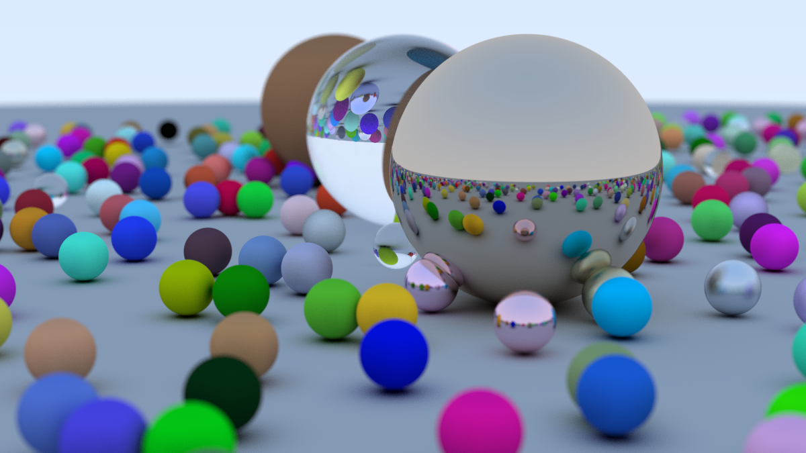
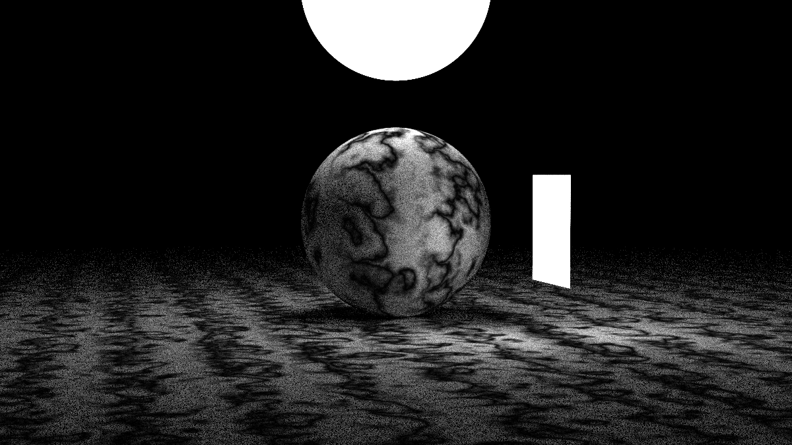

# Neon

Neon is a ray tracing renderer implemented in Rust, inspired by the ["Ray Tracing in One Weekend"](https://raytracing.github.io/books/RayTracingInOneWeekend.html) and ["Ray Tracing: The Next Week"](https://raytracing.github.io/books/RayTracingTheNextWeek.html) book series by Peter Shirley.

## Overview

This project aims to create a fast, idiomatic Rust implementation of the ray tracing concepts presented in the Ray Tracing book series. The goal was not just to port the C++ code to Rust, but to take advantage of Rust's performance characteristics and safety features to create a more efficient and maintainable renderer.

## Features

- Basic ray tracing capabilities
- Geometry primitives (spheres, quads)
- Material system (diffuse, metal, dielectric)
- Texture mapping
- BVH (Bounding Volume Hierarchy) Tree for performance optimization
- Motion blur
- Perlin noise
- Multi-threading support

## Requirements

- Rust >= 1.85

## Installation

Clone the repository:

```bash
git clone https://github.com/kTrzcinskii/neon.git
cd neon
```

Build the project:

```bash
cargo build --release
```

## Usage

Run the renderer:

```bash
cargo run --release -- [output] [scene]
```

Where:
- `scene` is the scene to render, available scenes are:
    - spheres
    - moving_spheres
    - two_checker
    - earthamp
    - perlin_noise
    - quads
    - simple_light
    - cornell_box
    - for_cornell_box
    - all_effects
- `output` is path to output file. This repo uses [image crate](https://docs.rs/image/latest/image/) for image handling and you can check supported file formats [here](https://docs.rs/image/latest/image/fn.save_buffer.html).

Example:

```bash
cargo run --release output.jpg "all_effects"
```

This will generate a file named `output.jpg` in the project directory.

## Implementation Notes

This implementation draws heavily from the concepts in "Ray Tracing in One Weekend" and "Ray Tracing: The Next Week" by Peter Shirley, but with a focus on Rust idioms and performance optimizations:

- Uses Rust's ownership model to avoid unnecessary copying
- Takes advantage of Rust's strong type system
- Implements multi-threading using Rayon
- Uses pattern matching over dynamic dispatch wherever possible

## Examples

Here are some example renderings created with Neon:




